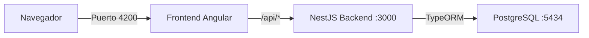

# Senavicola - Frontend

Este proyecto es el **Frontend** de la plataforma integral de gestión de gallinas ponedoras **Senavicola**. Está desarrollado con **Angular 21** (standalone components) y conecta al Backend NestJS mediante un proxy.

## 🏗️ Arquitectura

```
Frontend/
├── src/
│   ├── app/
│   │   ├── components/        # Componentes de UI (Dashboard, Usuarios, CRUD, etc.)
│   │   ├── services/          # Servicios Angular (HTTP client)
│   │   ├── guards/            # Guards de autenticación (AuthGuard)
│   │   ├── interceptors/      # Interceptores (JWT token, manejo de errores)
│   │   ├── layouts/           # Layouts (Admin, Auth)
│   │   ├── pages/             # Páginas principales
│   │   ├── interfaces/        # Interfaces TypeScript
│   │   └── app.routes.ts      # Rutas de la aplicación
│   ├── styles.css             # Estilos globales
│   ├── styles.scss            # Estilos globales (SCSS)
│   └── environments/
│       ├── environment.ts     # Configuración desarrollo
│       └── environment.prod.ts # Configuración producción
├── public/                    # Archivos estáticos (favicon, iconos)
├── proxy.conf.json            # Configuración de proxy (→ Backend)
├── angular.json               # Configuración de Angular CLI
├── package.json               # Dependencias y scripts
└── tsconfig.json              # Configuración de TypeScript
```

## 📋 Requisitos Previos

| Herramienta | Versión | Uso |
|---|---|---|
| **Node.js** | v20.x LTS | Ejecución del servidor de desarrollo |
| **npm** | 10+ | Instalación de dependencias |
| **Angular CLI** | 21.x | Opcional, para comandos avanzados |

> El **Backend NestJS** debe estar corriendo en `http://localhost:3000`. El frontend se conecta al backend mediante el proxy configurado en `proxy.conf.json`.

## 🚀 Instalación y Ejecución

### 1. Instalar dependencias

```bash
# Navegar a la carpeta del frontend
cd Frontend/laying-hens-frontend

# Instalar dependencias
npm install
```

> **Nota**: El `package.json` usa `npm` como package manager con Node 20+. No se requiere `--legacy-peer-deps` para el frontend.

### 2. Iniciar el servidor de desarrollo

```bash
npm start
```

> Alternativamente, si tienes Angular CLI instalado globalmente:
> ```bash
npm install -g @angular/cli
ng serve --proxy-config proxy.conf.json
```

El servidor de desarrollo se iniciará en **`http://localhost:4200`** y se conectará automáticamente al backend en `http://localhost:3000` mediante el proxy configurado.

### 3. Build de producción

```bash
npm run build
```

Los archivos compilados se generan en `dist/laying-hens-frontend/` y están optimizados para producción.

## 🌐 Proxy Backend-Frontend

El archivo `proxy.conf.json` redirige las peticiones del frontend al backend:

```json
{
  "/api": {
    "target": "http://localhost:3000",
    "secure": false,
    "changeOrigin": true,
    "pathRewrite": { "^/api": "" }
  }
}
```

Esto significa que todas las peticiones a `/api/*` en el frontend se reenvían al backend en `http://localhost:3000`.

### Configuración por entorno

- **Desarrollo** (`environment.ts`): `apiUrl: '/api'` — Usa el proxy
- **Producción** (`environment.prod.ts`): `apiUrl: '/api'` — Requiere un reverse proxy (nginx) en el servidor

## 📜 Scripts Disponibles

```bash
npm start           # Iniciar servidor de desarrollo (con proxy)
npm run build       # Build de producción
npm test            # Ejecutar tests unitarios
npm run watch       # Build en modo watch
```

## 🎨 Tecnologías

- **Angular 21** — Framework frontend (standalone components)
- **Angular Material 21** — Componentes UI
- **Tailwind CSS 3** — Utilidades de estilos
- **PrimeNG 21** — Componentes UI adicionales
- **Taiga UI** — Componentes UI (CDK, core, styles)
- **Chart.js** — Gráficos y reportes
- **SweetAlert2** — Diálogos y notificaciones

## 🔌 Conexión Backend-Frontend



1. El usuario accede a `http://localhost:4200`
2. El frontend hace peticiones a `/api/*`
3. El proxy de Angular redirige al backend en `http://localhost:3000`
4. El backend interactúa con PostgreSQL

## 📱 Módulos Principales

### Páginas
- **Dashboard** — Resumen de producción y estadísticas
- **Login** — Pantalla de autenticación
- **Usuarios** — CRUD de usuarios con activar/desactivar
- **Galpones** — CRUD de galpones
- **Lotes** — CRUD de lotes de gallinas
- **Alimentos** — CRUD de alimentos y movimientos
- **Producción** — Registro de producción manual/automática
- **Salud** — Registro de muertes y tratamientos
- **Alertas** — Sistema de alertas
- **Reportes** — Reportes y estadísticas

### Componentes de UI
- ConfirmDialog — Diálogo de confirmación
- Navbar — Barra de navegación
- Sidebar — Menú lateral
- Pagination — Componente de paginación

### Guards y Interceptors
- **AuthGuard** — Protección de rutas (redirige a login si no está autenticado)
- **TokenInterceptor** — Añade el token JWT a las peticiones
